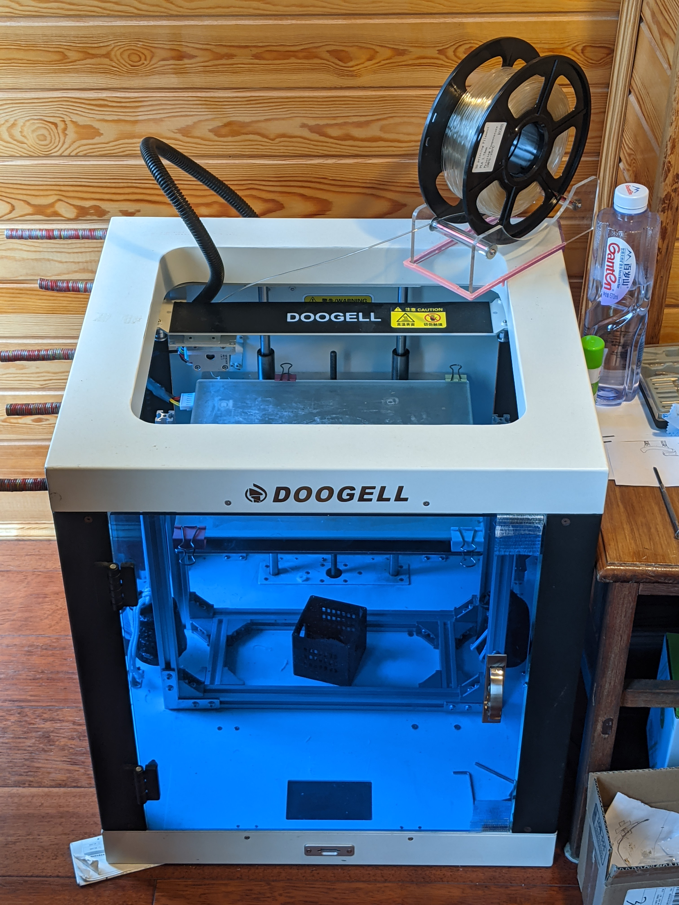
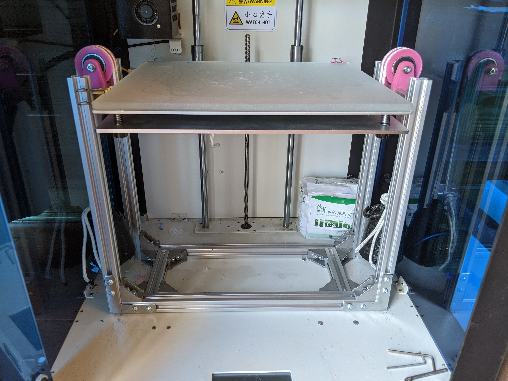

# Doogell Vega Calibration and Tuning
  
  
Bought 2nd hand for $500; CoreXY structure; Imported stepper motors and linear rails.  
Touch screen is inaccurate to the touch; One has to use Gcode to change the default printer parameters.   
Rectangular build plate; Heated bed; Replaced bed cover with tempered sanded-surface glass.  
  
# G-code
> G-code flavor = RepRap;
See the "GCodes" folder

# Build Plate
> Max bed temperature = 70;  
> X direction = ↓; X range = 0-250; //Positive direction from the back to the front
> Y direction = →, Y range = 0-293; //Belt starts to slip at 294  
> Z direction = up, Z range = 0-175; //for glass bed; Default is 300.   
> X/Y resolution = 0.1mm;  
> Z resolution = 0.04mm;  
  
# Printhead ([how these values are defined](https://community.ultimaker.com/topic/18484-printhead-settings/)) 
> Filament Diameter = 1.75mm;  
> Max hotend temperature = 260;  
> Default PID works well: P = 10; I = 2.5; D = 100; (Machine LCD screen under "Advanced Settings")  
The printer can not display the results of PID auto tuning on its LCD screen; Neither can it log the results onto a SD card.  
Integrate TuneAndLogTemperaturePID.gcode into the printer's Start G-code in Cura to set and to save the temperature PID. 

Extruder 0:    
> Nozzle size = 0.4mm; //default 
> X min = -29; //measured in the negative x direction  
> Y min = -37; //measured in the negative y direction  
> X max = 60; //measured in the positive x direction  
> Y max = 37; //measured in the positive y direction  
> Gantry Height = 82mm; //the lowest point on the rails in which the extruder assembly rides to the print bed when the nozzle is at height Z=0  
  
# Motion
Apply the Gcodes in "MeasureXYZMaxSpeeds.gcode" to measure the max speeds.  
> X/Y Max Speed = 300mm/s; //approximation  
> Z Max Speed =  12.5mm/s; //approximation  
> E Max Speed = 28 mm/s; //filament extrusion speed  

Default steps/mm  (Machine LCD screen under "Advanced Settings")  
X&Y = 80; Z = 400; E = 95.8;  
Calibrated values = existing value * desired value / actual value  
> X = 80 * .99840 = 79.872;  
> Y = 80 * 1.00334 = 80.267;  
> Z = 400 * 1.0019 = 400.76;  
Apply the Gcodes in "SetXYZStepsPerMm.gcode" to save the calibrated values.  
  
> Print Accelaration = 250 mm/s^2;  
> Print Jerk = 0.001 mm/s; //print head's max speed at which it can change direction
The Cura settings alone don't affect printer acceleration. Put these values in the Start G-code using the commands M201, M202, and M566. See [The Printer's Start and End G-codes in Cura](StartAndEndG-code.txt) for the tuned values.  

    
