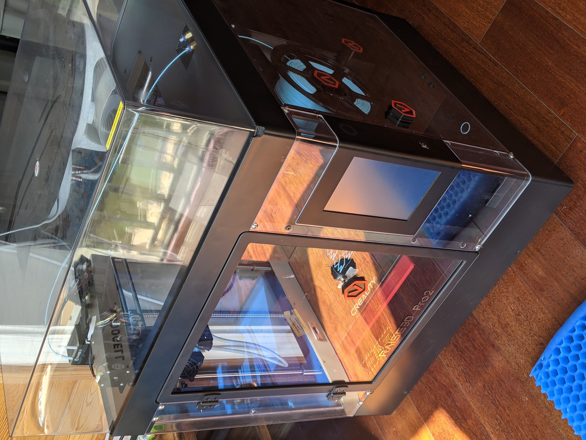

# [Raise3D Pro2](https://www.raise3d.com/products/pro2-3d-printer/) 

Bought 2nd hand for $2600.  
This printer lacks water cooling and needs the linear advance feature.  
Coasting cannot compensate for linear advance because one, there is no feature to compensate for the material lost during coasting; two, the amount of coasted material depends on the print speed.  
Instruction is based on the Cura Slicer which has the Tree Support Structure.  
a temporary value = 0.1;  //comments  
> Filament Diameter = 1.75mm; // a permanent setting   

## 0. Calibrate Printer

### Acquire Printer Specifications
> Rectangular; Heated bed; G-code flavor = Marlin;  
> Max hotend temperature = 310 Celsius;  
> Max bed temperature = 110;  
> X direction = →; X range = 0-295; // The gantry hits the belt beyond this point
> Y direction = ↑, Y range = 0-295; // The belt grinds beyond this point
> Z direction = up, Z range = 0-295; // The bed hits the metal bottom beyond this point.
> X/Y resolution = 0.0078125mm; // Remember to put a multiple of this as the silcer resolution.
> Z resolution = 0.00078125mm; // A layer height of 0.3mm is an integer multiple of the Z resolution.
  
Printhead Dimension wrt 0th Nozzle ([how these values are defined](https://community.ultimaker.com/topic/18484-printhead-settings/))  
> X min = -37; //measured in the negative x direction  
> Y min = -45; //measured in the negative y direction  
> X max = 63; //measured in the positive x direction  
> Y max = 70; //measured in the positive y direction  
> Gantry Height = 65mm; //the lowest point on the rails in which the extruder assembly rides to the print bed when the nozzle is at height Z=0   
  
Extruder 0:    
> Nozzle size = 0.4mm; // I used carbon hardened aftermarket steel nozzles. This saves me effort from changing nozzles.
> Nozzle Flat = 1.6mm;
  
Extruder 1:    
> Nozzle size = 0.3mm; 
> Nozzle Flat = 1.6mm;
> Nozzle Offset X = 25.3; //This is relative to the 0th nozzle. This value needs to be tuned. 
> Nozzle Offset Y = -0.2mm;
> Cooling Fan Number = 1;  
    
### Calibrate Printer XYZ Steps/mm ([reference](https://www.youtube.com/watch?v=W4CsD5lRvHY&feature=emb_logo))  
During this step, make sure the hotend is not obstructed in any direction!  
corrected value = existing value * desired value / actual value  
Default steps/mm X&Y = 80; Z = 800; //default settings are spot on  
  
### Calibrate Printer Extruder Steps/mm (The extrusion multiplier E) ([reference](https://mattshub.com/blog/2017/04/19/extruder-calibration))  
Remove the hot end. Calibrate when filament changes.  
Default steps/mm E = 6640;  //(default setting should be also spot on)[https://forum.raise3d.com/viewtopic.php?f=18&t=20580&hilit=extrusion+rate]

### Measure Printer Max Mechanical Speed
Use MeasureXYZMaxSpeeds.gcode and a stop-watch.  
> X/Y Max Speed = 150mm/s; 
> Z Max Speed =  5mm/s; //Same as from IdeaMaker  
> E Max Speed = 40mm/s; //From IdeaMaker; assumed.  

### Level Print Bed
0. Set the hotend and the bed at their intended printing temperatures. Hotend 210C; Buildplate 45C.  
1. Remove the removable parts of the bed assembly. Level the print bed against the print head with a digital indicator. See [Bed Leveling/Tramming a Raise3D N2 or N2 Plus](https://www.youtube.com/watch?v=MXAk4eBr21g&ab_channel=ViceChief) I 3D-printed an adaptor to mount the digital indicator to the hot end clamps. See the CustomUpgrades folder.
2. Level the entire printer with a bubble leveler placed on the print bed.  

### Tune Hotend and Printbed PIDs ([reference](https://reprap.org/wiki/PID_Tuning))  
Apply printer's PID auto tune feature.

### StartEndG-codes.txt
[Cura G-code has some perks](https://github.com/Ultimaker/Cura/issues/6383).  
Don't use the below G-code. Once set, it would always use the 1th of the 0th extruder as the initial extruder.  
Print long skirt/brim lines to prime the nozzle head for single extrusion mode instead.  
> T1  ;or T0
> G1 F200 E{switch_extruder_retraction_amount}      ;Extrude filament  
  
References:  
* [Cura keywords](https://github.com/Ultimaker/Cura/blob/master/resources/definitions/fdmprinter.def.json)
* IdeaMaker Settings and output G-codes
* [Github](https://github.com/Raise3D/Marlin-Raise3D-N-Series/blob/master/Marlin/Marlin_main.cpp)
* [Forum](https://forum.raise3d.com/viewtopic.php?t=16362)
  
## 1. Set Initial Slicer Parameters
Load default cura profile "Extra Fast", which has a layer height of 0.3mm.  
Oozing is the bane of dual extrusion. I decided to deploy Pro2 as a single extruder system. For this to work, treat it as a dual extruder in Cura but only enable one of the extruders.  
  
> Layer height = 0.3/0.15; //An integer multiple of the Z resolution and should be less than 80% of nozzle diameter. [stepper motor magic number](https://www.youtube.com/watch?v=WIkT8asT90A).  [Which layer height gives you the strongest 3D prints](https://www.youtube.com/watch?v=fbSQvJJjw2Q&t=644s).  
> Initial Layer Height = 0.3-0.1 = 0.2/0.05; // Set the initial layer height (ILH) so that the distance from the buildplate is the layer height. I used a piece of paper 0.1mm thick to level the bed. ILH == multiple of Z-resolution && (<= 80% of nozzle size) 
> Line Width = 0.7/0.45; //Minimum Line Width = Nozzle Size + Layer Height;  Maximum Line Width = Nozzle Flat Size + Layer Height;  [understand line width](https://dyzedesign.com/2018/07/3d-print-speed-calculation-find-optimal-speed/#:~:text=A%20general%20rule%20of%20thumb,bigger%20nozzles%20and%20layer%20height.)
> Support Line Width = 0.3/0.3; //Experiment with a smaller than nozzle diameter support line width. If the right extruder is selected as the support extruder, Cure automatically uses its line width as the support line width.
   
> Wall Line Count = Top Layers = Bottom Layers = 4; //[1-2-3-4-5-6 layers <=> 5-10-15-20-25-30% Infill](https://www.youtube.com/watch?v=sAZpnlzCwiU) 
> Infill = 20%;  
> Top/Bottom Pattern = Bottom Pattern Initial Layer = Zig Zag;  //Prefer Top Bottom Layer number a multiple of 2 if Zig Zag
> Optimize Wall Printing Order = True;  
> Print Thin Walls = True;  
> Infill Pattern = Gyroid;  //[increased strength for the lowest weight.](https://support.ultimaker.com/hc/en-us/articles/360012607079-Infill-settings) [Testing 3D printed infill pattern.](https://www.youtube.com/watch?v=upELI0HmzHc)
> Connect Infill Lines;  
> Randomize Infill Start;  
> Infill Travel Optimization = On;  
  
### Set Temperatures 
> Printing Temperature = 200/195 Celsius;  // Set and use a temperature tower to tune later.
> Initial / Final Printing Temperature / Standby Temperature = 200/195; // Set this to be equal to the print temperature to save print time.
> Build Plate Temperature = 35;  //Prefer levelling the bed at this temperature. 
> Z Hop after Extruder Switch Height = 0mm/0mm;  // Z Hop cases layers to misalign.

### Optimize Part Cooling
I customized all fans to cool the hot end instead of the printed parts.  
> Minimum Layer Time = 20s;  // Time required for a droplet of filament to cool and harden naturally.
> Minimum Layer Speed = 0.25mm/s;  // Same as jerk, which is effectively the minimum speed. 

### Set Print Speed (extrusion rate)
> Print Speed = Outer/Inner Wall Speed = Top/Bottom Speed = Support Speed = 75/130; // [Maximum 3D Printing Speed](https://dyzedesign.com/3d-printing-speed-calculator/) When the second extruder is selected as the support extruder, Cura automatically uses its print speed as the support speed.
> Initial Layer Speed = 20mm/s; //[Tune First Layer.](https://www.youtube.com/watch?v=pAFDEn3wGYo)  

### Optimize Acceleration and Jerk ([reference](https://github.com/Raise3D/Marlin-Raise3D-N-Series/blob/master/Marlin/Marlin_main.cpp) | [reference](https://marlinfw.org/docs/gcode/M204.html))
The hotend assembly should always apply the user specified acceleration to decelerate into and accelerate from its lowest continuous mechanical speed (the speed below which motor ticking is apparent), as determined by the physical motors. 
As [jerk is the speed the hotend assembly slows down to on corners](https://community.ultimaker.com/topic/21306-how-to-prevent-overshoot-corners-or-round-edges/?do=findComment&comment=198640), it should be set to the minimum continuous mechanical speed. Due to a lack of linear advance, the hotend could dwell too long at the corners overextruding. 
Pro2's default jerk and acceleration values work fine. However, Both Pro2's console and Cura only allow 1mm/s as the lowest XY jerk resolution. In addition, Cura uses deprecated G-code for these settings. Therfore, implement tweeked G-codes with M201, M204, M205 and M500 in the Printer Start G-code satisfying the following additional criteria:     
* Assume a bed gap of 0.1mm and 5mm/s bed travel speed, the minimum acceleration for the bed to not hit the nozzle can be calculated from the acceleration equation to be 50mm/s2.  
* Set acceleration and jerk to be a multiple of the Z resolution.  

### Calibrate Extruder Offset from each other
Print the calibration object in folder "CalibrationObjects/DualExtruderCalibration".  
Use Cura instead of Raise3D Pro2's console to apply these settings.

### Calibrate Flow Rate [Print Some Test Objects At This Step]  ([reference](https://e3d-online.dozuki.com/Guide/Flow+rate+%28Extrusion+multiplier%29+calibration+guide./89))  
[FlowRateCalibration.3mf](CalibrationObjects/FlowRateCalibration.3mf) Make sure you import the models only (without importing profiles)!  
Wall Line Count = 2; 
Top Layers = Bottom Layers = 0;  
Infill Density = 0;    
  
Corrected Flow Rate = Existing flow rate * Desired wall thickness / actual wall thickness
> Flow = 95/95;
(https://all3dp.com/1/common-3d-printing-problems-troubleshooting-3d-printer-issues/)
> Initial Layer Flow = 100%*0.3/0.2 = 150/300; // compensates for the gap between the nozzle and the bed

### Improve Bed Adhesion 
Use long skirt line instead of extruding waste material with start Gcode.  
> Build Plate Adhesion Type = Skirt; // Set to none to print brim for features such as Support and the Prime Tower only
> Build Plate Adhesion Extruder = ; // Use the secondary/support extruder to first draw the inside skirt line. This cleans waste material the best.
> Skirt/Brim Minimum Length = 0/3; // Use a value of 0 to disable left extruder brim for the Prime Tower
> Skirt Line Count = 2; 

### Determine Max Overhang Angle and Minimize Support Structure
[How to calculate maximum overhang angle](https://omni3d.com/blog/how-to-calculate-maximum-overhang-angle/)   
  
Print an overhang angle test object to confirm this. 

> Tree Support Branch Angle = 20; // This depends on the layer height and line width of the tree support walls
> Tree Support Branch Distance = Tree Support Branch Diameter = 1.4;  //multiple of line width
> Tree Support Branch Diameter Angle = 2.5;
> Tree Support Collision Resolution = 0.125; //multiple of resolution
> Support Placement = Everywhere; // works well with a thin support wall
> Support Overhang Angle = 41;
> Support Wall Line Count = 1;
> Support Density = 0;
> Enable Support Brim = True;
> Support Brim Line Count = 1;
> Support Top Distance = Support XY Distance = 0.6;  //twice layer height
> Support Stair Step Height = 0;

### Improve Surface Quality (Seams, Blobs, Zigs, Stringing and Oozing)
[Blobs and Zigs](https://www.simplify3d.com/support/print-quality-troubleshooting/blobs-and-zits/)  
Oozing is unavoidable. Molten filament droops under gravity.  
Filament retraction does not suck the molten filament. It merely relieves downward pressure.   
Ideally, the inactive nozzle is swiped on the support to remove its ooze, periodically and/or before it touches the printed area.  
Sadly, Pro2's inactive nozzle does not automatically lower to be wiped on Cura's Prime Tower; neither can the head-lifting feature be disabled.  

[Linear Advance](https://www.youtube.com/watch?v=n3yK0lJ8TWM&ab_channel=TeachingTech) minimizes Z Seams and blobs. Unfortunately [the pro2 doesn't have this feature yet.](https://forum.raise3d.com/viewtopic.php?t=21018)  Slow prints to compensate for now.  
> Z Seam Alignment = Random;  
 

> Retraction Distance = 0.8/0.8;  // Proportional to nozzle diameter
> Retraction Speed = 40/40mm/s; // From IdeaMaker, same as the E Max Speed

> Limit Support Retractions = False;  

> Combing Mode = Not in Skin; //Move in printed area so that oozed material is deposited on top thereof.
> Max Comb Distance With No Retract = 15mm;  
> Retract Before Outer Wall = True;  
> Travel Avoid Distance = 1/1; // Greater than half of nozzle flat diameter and multiple of XY resolution

### Calibrate Horizontal Expansion [Print Some Test Objects At This Step] ([reference](https://www.youtube.com/watch?v=UUelLZvDelU) | [reference](https://bradshacks.com/3d-printing-tolerancing/))
[HorizontalExpansionCalibration.3mf](CalibrationObjects/HorizontalExpansionCalibration.3mf) Use "import model" instead of "import project"! 
Support = None;  
Build Plate Adhesion = Skirt;  
Skirt Line Count = 2;  
Skirt Distance = 5mm;  
Skirt Minimum Length = 50mm;  
> Horizontal Expansion = Initial Layer Horizontal Expansion = -0.05; //Negative value makes outside of the part smaller.
> Hole Horizontal Expansion = 0.1; //positive value makes bigger holes

### Miscellaneous Settings  
> Maximum Resolution / Travel Resolution / Deviation / Minimum Polygon Circumference = 0.125mm;
> Minimum Polygon Circumference = 0.016mm;
> Slicing Tolerance = Inclusive;  
> Use Adaptive Layers = True; //set to false by default.
> Adaptive Layers Maximum Variation = 0.05; //half of line height and ensure less than maximum layer height 
> Adaptive Layers Variation Setp Size = 0.025;  // printer z step size
> Adaptive Layers Topography Size = 0.15; //same as layer height

### Dual Extrusion (Avoid)
> Enable Prime Tower = True; 
> Prime Tower Size = 10; //The prime tower's diameter should be larger than the nozzle separation for the inactive extruder's ooze to be cleaned onto it.
> Prime Tower Minimum Volume = 1;
> Wipe Inavtive Nozzle on Prime Tower = True; //Pro2's entire nozzle retracts, lessoning this feature's effectiveness
> Nozzle Switch Retraction Distance = 8/8mm; //Unmolten, solid filament should clear the hotend assembly.
> Nozzle Switch Retraction Speed = 40mm/s;

> Enable Ooze Shield = True;
